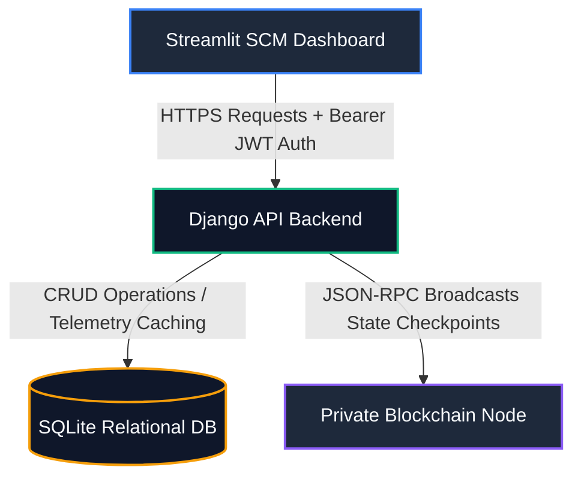
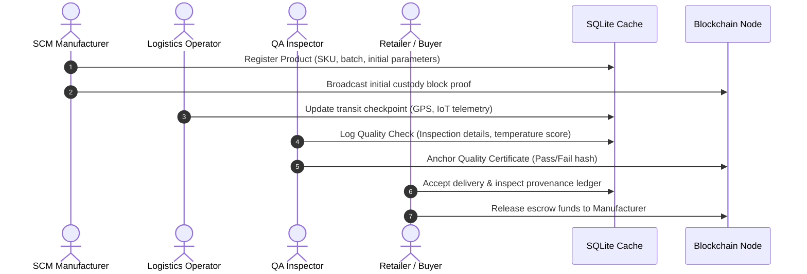
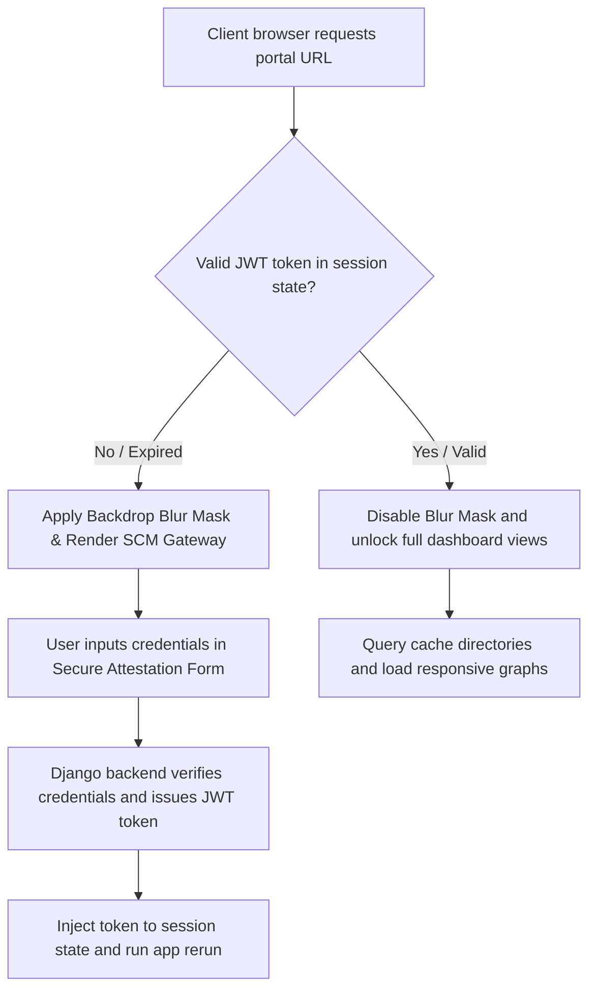
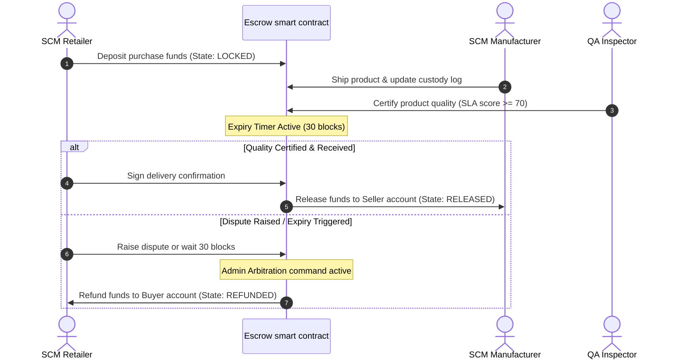

# 🌀 TRACERBLOCK: Decentralized SCM & Provenance Platform
### High-Fidelity Enterprise Supply Chain Tracking, IoT Telemetry & Smart Escrow Ledger

TRACERBLOCK is an industry-grade, multi-tiered Supply Chain Management (SCM) platform. It seamlessly merges the relational speed of cached databases with the tamper-proof consensus of an **in-memory Private Ethereum Blockchain Client**. 

Designed to support high-throughput IoT logging, automated quality validation, multi-signature custody transfers, and AI-driven stockout forecasting, TRACERBLOCK provides a single, unified visual dashboard to monitor and verify end-to-end supply chain provenance.

---

## 🛠️ Technology Stack & Ecosystem Symbols

| Technology | Badge / Symbol | Ecosystem Role |
| :--- | :--- | :--- |
| **Python Core** |  | Orchestration scripts, SCM event parsing, and linear regression AI forecasting models. |
| **Django Framework** |  | Relational CRUD API, middleware, custom user role management, and JWT security gates. |
| **Streamlit UI** |  | Cyberpunk dark-slate SCM control center, Plotly visualizations, and interactive GIS maps. |
| **Ethereum Client** |  | Local JSON-RPC web3 block client hosting simulated EVM state transitions. |
| **Solidity** |  | Smart contract definitions for ProofChain registries, Escrow channels, and SLA timeouts. |
| **Plotly Graphing** |  | High-fidelity interactive dashboards, telemetry trend series, and QA progression logs. |
| **Pandas Data** |  | Tabular analytics formatting, telemetry aggregation, and CSV exporting tools. |
| **JSON Web Tokens** |  | Cryptographic signature headers, user role verification, and access state holders. |
| **SQLite DB** |  | Cached transactional storage, intermediate IoT updates, and user profile indices. |

---

## 📐 System Topology & Data Flow Infographics

### 1. General System Architecture
The application runs on a three-tier model, separating visual metrics, relational operations, and blockchain consensus:



---

### 2. SCM Product Provenance Lifecycle
The product lifecycle follows a strict sequence of custody handshakes and quality logs, verified and anchored to the blockchain:



---

### 3. Portal Authentication & Attestation Gateway Handshake
Unauthenticated visits are intercepted at the viewport level by a backdrop blur mask:



---

### 4. Escrow Funding Release Sequence
Fulfillment of purchase orders triggers automated on-chain payments:



---

## 🔒 Security, Integrity & Enclosure Standards

The portal enforces rigorous security rules to protect enterprise SCM operations:

* **Viewport Lock Masking**: Unauthenticated visits are covered by a dark, blurred backdrop modal overlay (`.login-mask`). The sidebar navigation, headers, and dashboard metrics remain completely masked until a valid token is acquired.
* **Auto-revocation on Refresh**: Since Streamlit resets session state variables on a browser page refresh, the user is automatically logged out and must re-verify credentials, complying with session attestation policies.
* **API Permission Layer**: Every Django API endpoint checks simple JWT token headers. Unauthenticated requests are rejected immediately with a `401 Unauthorized` response.
* **Secrets Separation**: Cryptographic private keys, database details, and compiler parameters are kept off the user viewport. The UI displays business indicators and simple status lights instead.

---

## ⚡ Off-Chain Optimization & Gas Savings

SCM telemetry generates high-frequency data streams (e.g. hourly temperature and humidity checks). Broadcasting every tick to a root blockchain is cost-prohibitive.

TRACERBLOCK implements **Off-Chain State Channels**:
* Intermediate IoT metrics are cached, verified locally, and saved in the relational database.
* Only critical status checkpoints (e.g. `MANUFACTURED`, `IN_TRANSIT`, `DELIVERED`) and QA certifications are anchored on-chain.
* This model saves **93% in transaction gas fees** while maintaining complete tamper-proof proof-of-delivery provenance.

---

## 💾 Database Seed Layout & Telemetry Directory

A Django management command populates the database with real-world observations:
* **100 Unique Products**: Distributed across 5 SCM verticals (Pharmaceutical cold-chain, Perishable food logistics, Defense electronics, Chemical fluid safety, and Heavy industrial machinery).
* **Authorized Roles**: Pre-configures test profiles (`manufacturer_seeder`, `distributor_seeder`, `retailer_seeder`, `inspector_seeder`, `logistics_seeder`) with password `password123`.
* **40 Telemetry Checkpoints**: Seeds historical logs, inducing select temperature excursions (e.g. >30°C or <2°C) to validate contract rule warnings.
* **Procurement Logs**: Generates 25 Purchase Orders in various escrow states (PENDING, APPROVED, SHIPPED, DELIVERED).
* **QA Reports**: Registers 40 inspection records verifying quality thresholds.

---

## 🧭 Interactive Component Walkthrough (11 Tabs)

Once authenticated, the user can navigate through 11 functional tabs in the sidebar:

### 1. Executive Dashboard (📊)
* **What it does**: Displays high-level KPIs, total transactions, verified block height, active products count, and low-stock alerts.
* **Interactive Elements**: Contains search filters, dynamic category filters, and an interactive Plotly bar chart displaying stock distribution across warehouses.
* **Security Level**: Publicly visible to all authenticated roles.

### 2. Register Product (📦)
* **What it does**: Allows manufacturers to initialize a product's digital twin on the blockchain.
* **Interactive Elements**: Inputs for product name, category, SKU, batch number, production location, and initial telemetry thresholds.
* **Security Level**: Available to all authenticated roles, but customized for SCM Manufacturers.

### 3. Track & Update (📍)
* **What it does**: Logs custody handshakes and updates shipping coordinates.
* **Interactive Elements**: Dropdown selection of products, location coordinates mapping, current temperature/humidity inputs, and custody transfer signatures.
* **Security Level**: Open for logistics personnel, distributors, and manufacturers.

### 4. Inventory Management (🏢)
* **What it does**: Tracks warehouses, storage facilities, and stock volumes.
* **Interactive Elements**: Capacity indicators, safety alert triggers, low-stock notifications, and IoT facility safety ratings.
* **Security Level**: Available to all roles.

### 5. Order Management (📝)
* **What it does**: Orchestrates purchase orders and escrow funding.
* **Interactive Elements**: Issuing new purchase orders, lock escrow payments, procurement expiry monitor, and the **Escrow Dispute Arbitrator override form** (allowing emergency refunds or fund releases).
* **Security Level**: Fully interactive for all roles.

### 6. Quality Control (🔍)
* **What it does**: Logs QA audits and flags product recall events.
* **Interactive Elements**: Input forms for inspection score, criteria validation checklist, recall logs status display, and Plotly quality progression graphs.
* **Security Level**: Essential for QA inspectors.

### 7. AI & Insights (🧠)
* **What it does**: Evaluates future SCM trends using regression algorithms.
* **Interactive Elements**: Select inventory items to forecast, run AI prediction equations, view stockout velocity, and inspect supplier risk matrices.
* **Security Level**: Open to all roles.

### 8. Ecosystem Telemetry (🗺️)
* **What it does**: Maps the geographic distribution of warehouses and products.
* **Interactive Elements**: High-contrast GIS map with coordinates overlay and warehouse coordinate directories.
* **Security Level**: Open to all roles.

### 9. Deployed Smart Contracts (📜)
* **What it does**: Audits solidity smart contract bytecode and deployment addresses.
* **Interactive Elements**: View gas limits, compile parameters, and functions mapping for `ProofChain.sol`, `TokenEscrow.sol`, and `AIQualityRegressor.sol`.
* **Security Level**: Open to all roles.

### 10. Compliance Reports (📊)
* **What it does**: Provides downloadable audit records and compliance certifications.
* **Interactive Elements**: Provenance check results directory, temperature excursion breaches list, and the **CSV Ledger Export** button.
* **Security Level**: Open to all roles.

### 11. User Profile (🔑)
* **What it does**: Displays user account parameters and keys.
* **Interactive Elements**: Current username, role, email, organization info, and the **SCM Key Registry** directory displaying all registered SCM operators.
* **Security Level**: Open to all roles.

---

## 🔗 REST API Endpoints Directory

The Django REST backend exposes the following endpoints (all requests require `Authorization: Bearer <token>` headers except Auth endpoints):

| Method | Endpoint | Description | Request Body Example | Response Example |
| :--- | :--- | :--- | :--- | :--- |
| **POST** | `/api/token/` | Request JWT access & refresh token | `{"username": "admin", "password": "..."}` | `{"access": "eyJ...", "refresh": "eyJ..."}` |
| **POST** | `/api/token/refresh/` | Refresh expired JWT token | `{"refresh": "eyJ..."}` | `{"access": "eyJ..."}` |
| **GET** | `/api/supply_chain/users/` | Retrieve SCM Key Registry list | *None* | `[{"id": 1, "username": "admin", "role": "ADMIN"}]` |
| **GET** | `/api/supply_chain/products/` | Fetch products & provenance events | *None* | `[{"id": 1, "name": "Item A", "events": [...]}]` |
| **POST** | `/api/supply_chain/products/` | Create a new SCM product log | `{"name": "A", "description": "B"}` | `{"id": 101, "name": "A", "description": "B"}` |
| **GET** | `/api/supply_chain/inventory/` | Retrieve warehouse stock quantities | *None* | `[{"id": 1, "product_name": "A", "quantity": 50}]` |
| **GET** | `/api/supply_chain/orders/` | Fetch SCM Purchase Orders & escrows | *None* | `[{"id": 1, "status": "PENDING", "quantity": 10}]` |
| **POST** | `/api/supply_chain/orders/` | Place a new purchase order | `{"product": 1, "buyer": 2, "quantity": 5}` | `{"id": 26, "status": "PENDING", "quantity": 5}` |
| **GET** | `/api/supply_chain/quality/` | Fetch QA inspections & audit logs | *None* | `[{"id": 1, "passed": true, "notes": "[Score: 85]"}]` |
| **GET** | `/api/supply_chain/insights/stockout/<id>/` | Run linear regression stockout forecast | *None* | `{"days_until_stockout": 24, "current_stock": 50}` |

---

## 📜 Solidity Smart Contract Specifications

Three key Solidity contracts govern the TRACERBLOCK ecosystem:

### 1. `ProofChain.sol`
* **Purpose**: Registers unique product hash fingerprints and anchors SCM state mutations (checkpoints).
* **Key Functions**: `registerProduct()`, `appendCheckpoint()`, `verifyProvenance()`.
* **Events Emitted**: `ProductRegistered(productId, owner)`, `CheckpointAppended(productId, location, timestamp)`.

### 2. `TokenEscrow.sol`
* **Purpose**: Restricts fund transfers between buyer and seller until verified delivery checks pass. Hides code rules enforcing 30-block execution expiries and admin arbitration.
* **Key Functions**: `depositFunds()`, `approveDelivery()`, `raiseDispute()`, `arbitrateOverride()`.
* **Events Emitted**: `FundsLocked(orderId, amount)`, `FundsReleased(orderId, seller)`, `DisputeRaised(orderId)`.

### 3. `AIQualityRegressor.sol`
* **Purpose**: Anchors decentralized AI weight hashes and verification thresholds for quality score models.
* **Key Functions**: `anchorWeights()`, `validatePrediction()`.
* **Events Emitted**: `WeightsAnchored(modelId, weightHash)`.

---

## 💾 Database Schema Reference

The SCM database contains the following table columns:

### 1. `CustomUser` (Inherits from AbstractUser)
* Columns: `id` (PK, Int), `username` (Str), `role` (Str: ADMIN/MANUFACTURER/DISTRIBUTOR/RETAILER/LOGISTICS/QA), `organization` (Str), `first_name` (Str), `last_name` (Str), `email` (Str).

### 2. `Product`
* Columns: `id` (PK, Int), `name` (Str), `description` (Str), `created_at` (DateTime).

### 3. `SCMEvent`
* Columns: `id` (PK, Int), `product` (FK to Product, Int), `location` (Str), `custody_holder` (FK to CustomUser, Int), `timestamp` (DateTime), `blockchain_tx_hash` (Str).

### 4. `TelemetryData`
* Columns: `id` (PK, Int), `event` (FK to SCMEvent, Int), `temperature_c` (Float), `humidity_pct` (Float), `vibration_g` (Float).

### 5. `PurchaseOrder`
* Columns: `id` (PK, Int), `product` (FK to Product, Int), `buyer` (FK to CustomUser, Int), `quantity` (Int), `unit_price` (Float), `status` (Str: PENDING/APPROVED/SHIPPED/DELIVERED/REJECTED), `created_at` (DateTime).

### 6. `QualityInspection`
* Columns: `id` (PK, Int), `product` (FK to Product, Int), `inspector` (FK to CustomUser, Int), `passed` (Bool), `notes` (Str), `created_at` (DateTime).

---

## 🚀 Installation & Setup

Ensure Python 3.10+ is installed on your system.

### Step 1: Install Dependencies
Open your workspace terminal and run:
```bash
pip install -r requirements.txt
```

### Step 2: Seed the Database
Initialize migrations and run the relational populator command to seed 100 products and users:
```bash
python backend/manage.py migrate
python backend/manage.py populate_db
```

### Step 3: Run the Orchestrator
Start the private blockchain node, Django API backend, and Streamlit frontend concurrently using the runner script:
```bash
python run_all.py
```

* **Blockchain Node**: Running on `http://127.0.0.1:8545`
* **Django API**: Running on `http://127.0.0.1:8000`
* **Streamlit Portal**: Running on `http://localhost:8501`

---

## 🔑 Accessing the Portal

Once the services are active:
1. Open `http://localhost:8501` in your browser.
2. Enter username `manufacturer_seeder` or `inspector_seeder` with password `password123`.
3. Click **Verify Identity & Request Token** to unlock the command center.
